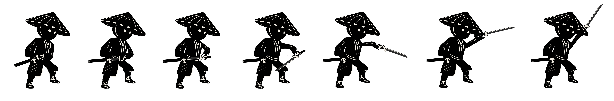
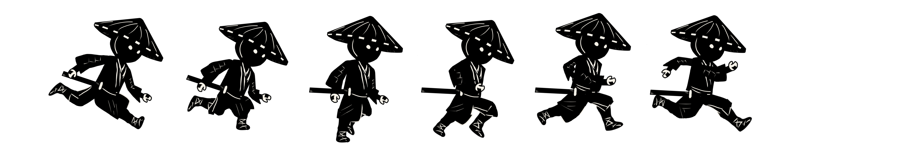

## Table of Contents

In progress...

1. [Introduction](#introduction)
2. [Features](#features)
3. [Demo](#demo)
4. [Assets](#assets)
5. [Credits](#credits)
6. [License](#license)

## Introduction

This is my first 2D game made using Unity. It is a simple platformer game where the player plays as a samurai in a fantasy world
where he fights through distorted and corrupt entities possesed by god-like beings.

The game is currently in progress, and will be updated throughout.

## Features

- Standard control: `W A S D` to move, `Space` to jump and `Left Mouse Button` to attack.
- Patrolling enemies; when player is detected within radius, will start chasing the player.

## Demo

## Assets
All the sprites are drawn by me using Krita.

## Credits

## License
